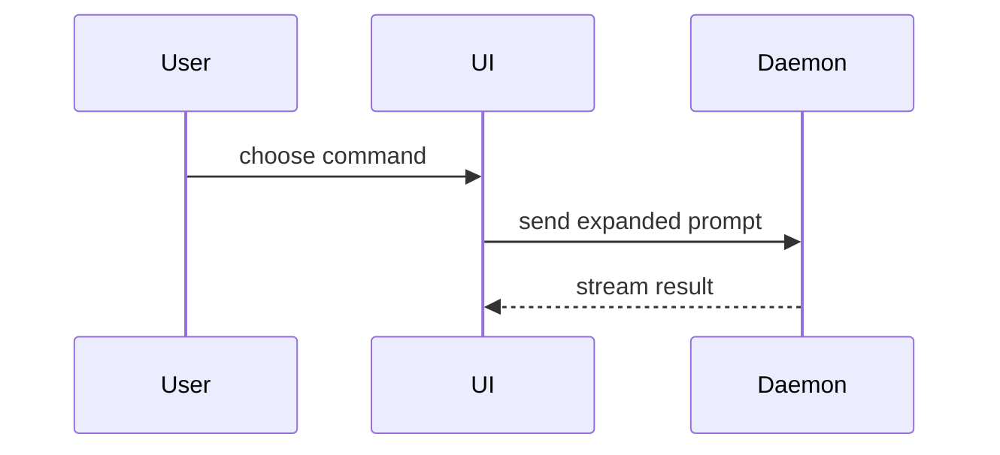

Help the user understand the current topic of conversation visually. Skip the preamble and keep prose brief. Pick the smallest view that makes the key point clear.

## Core Principles

1. **Choose the smallest useful visual.** Use only the form and detail needed to make the key relationship clear.
2. **Ground the picture in evidence.** Base codebase visuals on inspected source, and label proposed structures as proposals rather than existing code.
3. **Keep prose subordinate.** Place each visual next to the short text it supports, without narrating the same information twice.
4. **Respect artifact boundaries.** Keep visuals inline during read-only explanations; create files only when the user requested an artifact or the task already includes file creation.

## Visual Patterns

- Show logic or an algorithm as pseudocode:

```text
on(save)
  if content is unchanged
    return cached result
  write new content
  return fresh result
```

- Show runtime control flow as a call tree:

```text
submitForm
  createSession
    persistPrompt
    launchAgent
  navigateToSession
```

- Show UI structure as a component tree, including state and module boundaries that matter:

```tsx
<SessionPage> (apps/example/src/routes/session.tsx)
  useSessionEvents()
  <SessionToolbar>
    <RunSkillButton> (packages/ui)
```

- Show file responsibility or a broad refactor as a shallow file tree:

```text
src/
├── commands/       # parses user actions
├── sessions/       # owns session state
└── transport/      # sends API requests
```

- Show component interaction, control flow, or data flow with Mermaid:



- Use `diff` when the point is what changes and the surrounding shape already exists. Match the diff shape to the topic.

For a component change:

```diff
 <SessionPage>
   useSessionEvents()
   <SessionToolbar>
+    <RunSkillButton />
   <SessionTimeline>
+    <SkillResultCard />
```

For a file-layout change:

```diff
 src/
 ├── commands/
+│   └── show-me.ts       # expands the slash command
 ├── sessions/
-└── transport.ts
+└── transport/
+    ├── client.ts
+    └── stream.ts
```

For a call-tree or call-stack change:

```diff
 submitForm
   createSession
     persistPrompt
+    expandSkillMention
     launchAgent
-  navigateToSession
+  navigateToSession
+    subscribeToEvents
```

For a state or control-flow change:

```diff
 on(save)
-  write content
+  if content is unchanged
+    return cached result
+  write new content
+  invalidate cache
```

- Show the whole block when most of it is new, when omitted context would hide ownership or order, or when the user needs a copyable target shape:

```ts
function expandSkill(command: string): string {
  const skillName = command.slice(1)
  return `use the ${skillName} skill`
}
```

- For a visual UI, layout, state comparison, or concept too dense for Mermaid, create one focused HTML file only when the user asks for an artifact or the current task already includes creating files. Make it a diagram, infographic, or short slide deck, whichever fits the point. Match the product's colors, type, spacing, and components; use real labels and data; support desktop and mobile. Return a clickable file link instead of opening an application automatically.

- Place each visual next to the short text it supports. Keep only the calls, files, props, states, and boundaries needed to answer the user's current question.

You may use one of these, you may use several, it is unlikely you will use all of them. Use your judgement and don't overwhelm the user.

## Common Mistakes

| Mistake | Better approach |
| --- | --- |
| Replacing one wall of prose with a wall of boxes | Keep only the nodes and edges needed for the current point |
| Inventing files, calls, props, or states | Inspect the source or mark the visual as proposed |
| Using Mermaid for a relationship a tiny tree explains better | Choose the smallest fitting visual form |
| Creating or opening HTML during a read-only explanation | Keep the visual inline unless the user requested an artifact |
| Repeating the visual in prose | Add only the caveat, decision, or next step the visual cannot show |

## Review Output Format

When using this skill in a code or design review, put the affected shape next to the finding it explains. Prefer a compact `diff`, call tree, component tree, or sequence diagram, followed by the relevant file links and no more prose than the finding needs. Do not let the visual replace concrete evidence.
